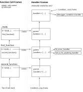

RuntimeCondition
================

RuntimeCondition is a GDSCript library which aims to provide you with a flavour
of exception handling inspired by Common Lisp's condition system.

Since GDScript does not support exception handling and doesn't provide means
to unwind or otherwise control the stack, exception handling cannot be made
to work without the users (programmers) cooperation. This is what this addon 
tries to simplify.

# Differences to traditional exception handling

Traditional exceptions can be thrown/raised and will unwind the call stack up
to the place where a matching catch statement is present. They will also jump
over any code between the call which led to the raised exception and the 
exception handler.

RuntimeCondition cannot unwind the stack by itself, thus it requires the user
to cooperate. 

RuntimeCondition also doesn't run the exception handler *after* unwinding the
stack but *before*, meaning that the condition is handled at exactly the point
where it was raised. 

Exception handlers are functions of one argument (a condition) which can do
arbitrary work. If they return a condition (possibly the same that was passed
in to handle), the condition is considered 'unhandled' and the next matching
handler will be called for another attempt to handle the condition. If you
return another value (or null), this value will be returned by catch(..).

For this to work, you must bind condition handlers to the conditions which you
want to handle. You do this by creating a HandlerFrame object as a local 
variable in each function you want to participate in the condition handling.

# Implementation overview

Each function where you expect to throw or catch a condition, and each function
where such a condition might pass through on its travel along the call stack,
needs exactly one HandlerFrame object. Each HandlerFrame object stores a 
list of bound handlers and a reference to the parent HandlerFrame. When a 
condition is raised, the HandlerFrames will be search from top to bottom and
in reverse order for a matching handler, the handler will be called and the 
stack will then be unwound until we reach the HandlerFrame where the handler
was bound.

HandlerFrame objects can be created with the `bind` method:
	
	func some_function(...):
	    # Creates the HandlerFrame for this function. Since it is a local 
		# variable, the frame will automatically be destroyed when the 
		# function exits.
        var E = Condition.bind(...)

Assuming a condition is raised in `second_function`, the HandlerFrame at the top
of the stack (which coincides with the call frame of `second_function`) will look 
through it's own handlers, it's parent's handlers and so on until it finds a 
handler that matches the Condition that was raised. It then runs the handler
and returns. 

The stack should now unwind up to the HandlerFrame where the handler that was
just run was bound. Unfortunately, there is no support to do this automatically
in GDScript.

So here's where the user's cooperation is needed. Each function which has a
HandlerFrame must check it's HandlerFrames' `unwind` property and immediately
return if true. In practice, this looks like this:
	
	func first_function(...):
		# Create the HandlerFrame for this function
		E = Condition.bind()
		
		...
		
		var result = E.catch(second_function(...))
		# This ensures we can unwind the stack if necessary
		if E.unwind: return
		
		# More code that should only run for valid results
		...

	func second_function(...):
		E = Condition.bind()
		...
		if something_bad_has_happened:
			var result = E.raise(Error.new("Oh no! Something bad has happened!"))			
			if E.unwind: return

If you follow this protocol, the condition framework can make sure that the
unwinding continues until you reach the correct function with with correct
HandlerFrame, at which point the handler's return value can be caught with
`catch`.
	
## How to bind and write condition handlers

In order to handle a condition, we need to bind a handler for the condition
class in question. This is done as follows:

	# This is a condition handler which handles the condition it's given
	func error_handler(condition: RuntimeCondition):
		print("Oh no! Something happened!")
		print("But I can handle it.")
		return 23 
	
	func first_function(...):
		# Binds an Error handler
		E = Condition.bind(Condition.Error, error_handler)
		
		...
		
		var result = E.catch(second_function(...))
		# This ensures we can unwind the stack if necessary
		if E.unwind: return

		# Rest of the function
	
If `second_function` raises an Error, it will find `error_handler` in the
HandlerFrame of `first_function`, run the handler, get a return value of 23
and pass this on as the return value of `catch(...)` when `second_function` 
returns. In the above case, `catch` would return 23, which would then be
asigned to `result` and the rest of the function would continue to execute
normally, since the condition was handled. 

`E.unwind` checks whether the function should continue normally or return
immediately, and you, the programmer, will have to honor this by adding a 
check after every `catch`, every `raise` and every function call which might
have raised a condition, even if you don't intend to catch it.

## Order of bound handlers

The order of the handlers you bind with the `bind` method matters. Assume 
you have the following two bindings:
	
	E = Condition.bind(Condition.Error, error_handler,
					   RuntimeCondition, catch_all_handler)

This will not work as intended because `Contition.Error` is derived from 
`RuntimeCondition` and the order in which matching handlers are searched for
is reversed. So if a `Condition.Error` condition was raised, `catch_all_handler`
would be selected as the first handler matching the condition. 

If you switch the order of the bindings, they work as intended:
	
	
	E = Condition.bind(RuntimeCondition, catch_all_handler,
					   Condition.Error, error_handler)

Now all `Condition.Error` conditions will be handled by `error_handler`, and
every other condition will be handled by `catch_all_handler`.

Note that binding such a catch-all makes sense near the top level, but other,
more specific handlers further along the call stack will not get a chance to
run (unless the catch-all declines to handle the condition, which you can 
achieve by returning the condition you received:
	
	# A handler that doesn't handle it's condition. This gives other matching
	# handlers a chance to run.
	func stupid_handler(condition: RuntimeCondition):
		print ("Oh no! I can't handle this!")
		return condition

					   
	
		
		
		
		
		
	
